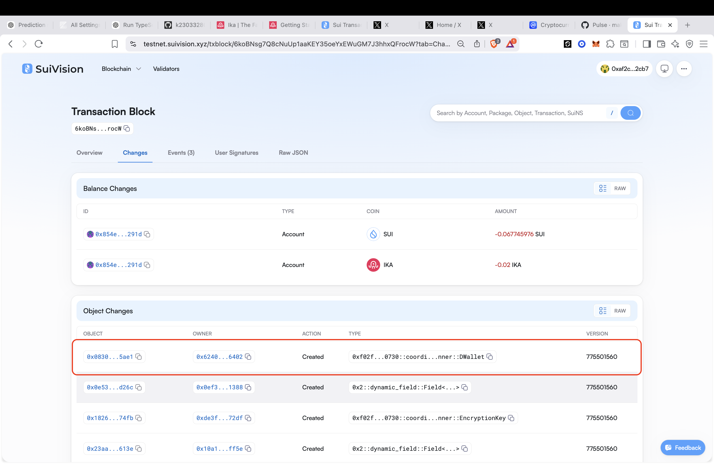

# ika_dWallet_tutorial

## Setup

1. Install dependencies:
```bash
pnpm install
```

2. Create a `.env` file in the root directory:
```env
SUI_PRIVATE_KEY=your_private_key_here
SUI_RPC_URL=https://fullnode.testnet.sui.io:443
⚠️ The public rpc url has some issues with rate limiting so it is recommended to use some other rpc url: like shinami rpc old fashion:)
```

## Commands

### Create a dWallet
Runs the DKG (Distributed Key Generation) process and saves the result to `output/dwallet_result.json`.
```bash
pnpm create-dWallet
```

After you get the transaction digest from running the code, you will get dWallet Object ID from the explorer and paste the ID to the json file:


"dWalletObjectID": "0x08300505846638854bf49f8392b2437f8544029510561176a50e00e53be25ae1"

### Activate a dWallet
Accepts the encrypted user share and activates the dWallet. Requires `output/dwallet_result.json` to exist.
```bash
pnpm activate-dWallet
```

### Create a Presign
Requests a presign from the network. Requires the dWallet to be in `Active` state.
```bash
pnpm create-presign
```

## Order of Operations

Run the commands in this order:

```
1. pnpm create-dWallet
2. pnpm activate-dWallet
3. pnpm create-presign
```
